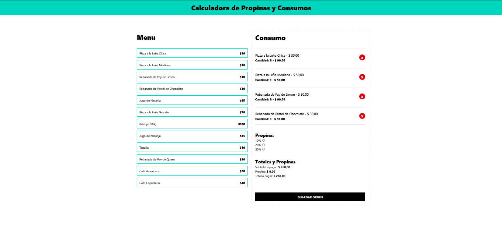

# Calculadora de Propinas con React, TypeScript y Tailwind CSS

Este proyecto es una calculadora de propinas interactiva desarrollada con **React** y **TypeScript**, estilizada con **Tailwind CSS**. Permite a los usuarios:

- Ingresar el consumo de su pedido.
- Seleccionar el porcentaje de propina que desean dejar.
- Ver cálculos automáticos de:
  - **Propina**
  - **Subtotal**
  - **Total a pagar**

Además, los usuarios pueden:
- Agregar o eliminar productos del pedido.
- Ajustar la propina y ver actualizaciones en tiempo real.

La interfaz es **responsiva** y fácil de usar, brindando una experiencia intuitiva para calcular propinas de manera rápida y precisa.

